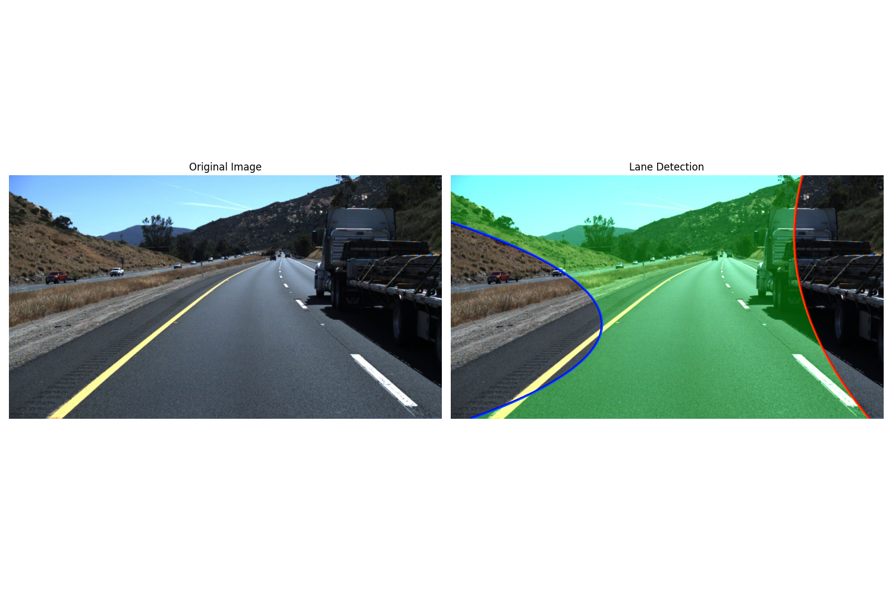

# Lane Detection System for Autonomous Driving



## Overview

This project implements a comprehensive lane detection system for autonomous vehicles using both traditional computer vision and deep learning approaches. The system can accurately identify lane markings in various driving conditions, including highways, urban streets, and curved roads.

## Features

- **Dual Detection Approaches**: 
  - Traditional CV-based detection using Hough transforms and polynomial curve fitting
  - Deep learning-based detection using a U-Net architecture for semantic segmentation

- **Complete Pipeline**:
  - Data preprocessing and augmentation
  - Model training with weighted loss function
  - Post-processing for lane visualization
  - Performance evaluation metrics

- **Lane Analysis**:
  - Lane boundary detection
  - Lane curvature calculation
  - Vehicle position relative to lane center
  - Drivable area identification

## Performance Metrics

The model achieves the following metrics on the test dataset:

- **Precision**: 18.0%
- **Recall**: 96.6%
- **F1 Score**: 30.1% 
- **IoU**: 17.9%
- **Processing Time**: 518.7 ms per frame (1.9 FPS)

While precision is relatively low, the high recall ensures that nearly all lane markings are detected, which is critical for safe autonomous driving applications.

## Visual Results

The system successfully detects lanes in diverse driving conditions:

| Original Image | Lane Detection |
|----------------|---------------|
|  |  |
|  |  |
|  |  |

## Installation

```bash
# Clone this repository
git clone https://github.com/RahilZaidi/lane-detection-system.git
cd lane-detection-system

# Create a virtual environment
python -m venv venv
source venv/bin/activate  # On Windows: venv\Scripts\activate

# Install dependencies
pip install -r requirements.txt
```

## Dataset

This project uses the TuSimple Lane Detection dataset. Due to size constraints, the dataset is not included in this repository.

To download the dataset:
1. Visit [TuSimple Lane Detection Challenge](https://github.com/TuSimple/tusimple-benchmark)
2. Follow their instructions to download the dataset
3. Place the dataset in a directory named `tusimple_dataset` at the root of this project

## Usage

### Process a Single Image

```bash
python main.py --mode image --input path/to/image.jpg --output_dir output
```

### Process a Video

```bash
python main.py --mode video --input path/to/video.mp4 --output_dir output
```

### Batch Process Multiple Images

```bash
python main.py --mode batch --input path/to/images_directory --output_dir output
```

### Training a Deep Learning Model

```bash
# Preprocess the dataset
python preprocess_tusimple.py --source tusimple_dataset --dest processed_dataset

# Train the model
python train.py --data_dir processed_dataset --model_dir models --log_dir logs --model_type unet --epochs 50 --batch_size 8
```

### Evaluate Model Performance

```bash
python evaluate_model.py --model models/lane_detector.keras --test_dir test_data --output evaluation_results.txt
```

## Project Structure

```
lane_detection/
├── data/               # Dataset handling
├── models/             # Model implementations
│   ├── cv_detector.py  # Traditional CV-based detector
│   └── dl_detector.py  # Deep learning-based detector
├── utils/              # Utility functions
├── config.py           # Configuration parameters
├── main.py             # Main execution script
├── train.py            # Training script
├── preprocess_tusimple.py # Dataset preparation
└── evaluate_model.py   # Performance evaluation
```

## Technical Approach

### Traditional Computer Vision Pipeline

1. **Preprocessing**: Grayscale conversion, Gaussian blur
2. **Edge Detection**: Canny edge detection
3. **Region of Interest**: Focus on the road area
4. **Line Detection**: Hough transform for line segments
5. **Lane Fitting**: Polynomial curve fitting
6. **Visualization**: Overlay lanes on original image

### Deep Learning Approach

1. **Data Preparation**: Convert TuSimple annotations to binary masks
2. **U-Net Architecture**: Encoder-decoder network with skip connections
3. **Weighted Loss Function**: Address class imbalance (lane vs. background)
4. **Post-processing**: Convert predictions to lane boundaries
5. **Lane Parameter Extraction**: Calculate curvature and position

## Future Improvements

- Improve precision through better post-processing
- Implement temporal smoothing for video processing
- Add lane type classification (solid, dashed, double)
- Optimize for real-time performance through model quantization
- Incorporate multi-camera views for more robust detection

## Acknowledgments

- TuSimple for providing the lane detection dataset
- OpenCV community for computer vision tools
- TensorFlow team for the deep learning framework

## License

This project is licensed under the MIT License - see the LICENSE file for details.

## Author

Rahil Zaidi - [GitHub](https://github.com/RahilZaidi)
